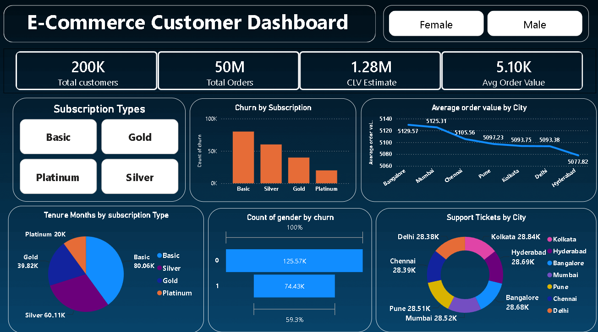

# E-Commerce-Customer-Dashboard-
This Power BI dashboard provides a comprehensive analysis of customer engagement, subscription plans, churn rate, average order value, and city-wise performance using over 200K customer records. It helps businesses identify high-value customers, reduce churn, enhance customer experience, and drive sustainable revenue growth through data-driven decision-making.

Dashboard Preview
-
-----

----
💼 Business Solution
-
This Power BI Customer Analytics Dashboard transforms data from 200K+ customers and 50M+ orders into actionable business insights that support smarter decision-making and sustainable growth. The dashboard identifies the Basic subscription plan as having the highest customer base but also the highest churn, enabling businesses to implement targeted retention campaigns and loyalty programs. By tracking Customer Lifetime Value (CLV: 1.28M) and Average Order Value (AOV: ₹5.10K), it helps prioritize high-value customers and maximize long-term profitability. Regional analysis highlights Mumbai as the top-performing city (AOV: ₹5,125.31) while identifying lower-performing regions for focused marketing and sales optimization. Customer support insights reveal Kolkata has the highest ticket volume, helping improve service quality and operational efficiency.

------------
📬 Connect With Me
--
- 💼 Role : Aspiring Data Analyst
- 📧 Email :kumarshagun978@gmail.com
- 🔗 LinkedIn :https://www.linkedin.com/in/shagun-8544962a0/
- 📢 Open To Work : Data Analyst | BI Analyst | Business Analyst

---------------
